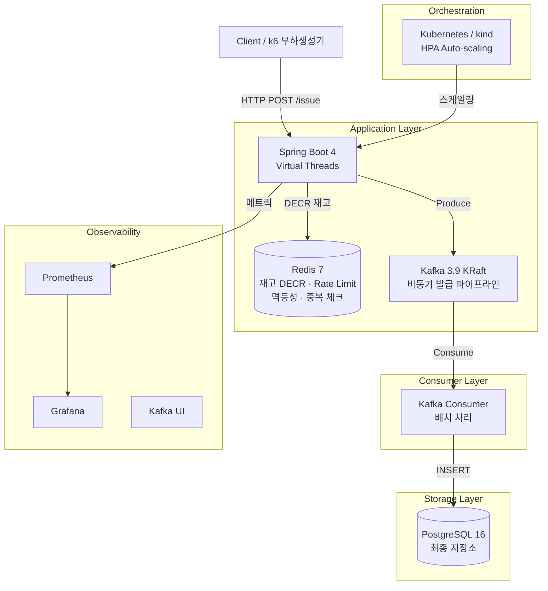
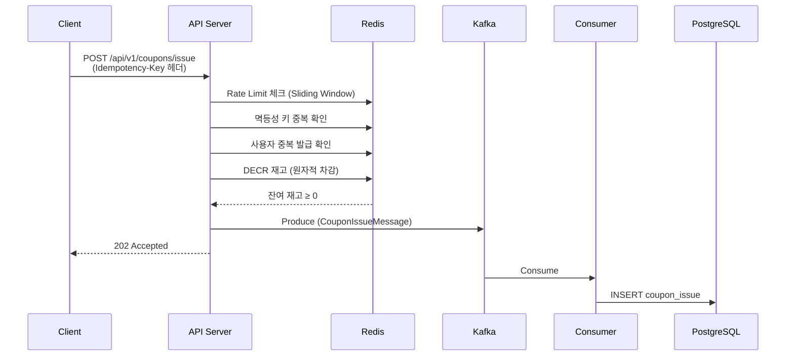

# High-Concurrency Event Platform

선착순 쿠폰 발급 시스템 — 대규모 동시 요청을 안정적으로 처리하는 이벤트 플랫폼

## 아키텍처



### 데이터 흐름 (쿠폰 발급)



---

## 기술 스택

| 분류 | 기술 | 버전 |
|------|------|------|
| **Language** | Java | 21 (Virtual Threads) |
| **Framework** | Spring Boot | 4.0.3 |
| **Database** | PostgreSQL | 16 |
| **Cache** | Redis | 7 |
| **Message Broker** | Apache Kafka (KRaft) | 3.9.0 |
| **ORM** | Hibernate | 7.x |
| **Migration** | Flyway | 11.x |
| **API Docs** | Springdoc OpenAPI | 3.0.0 |
| **Orchestration** | Kubernetes (kind) | — |
| **Monitoring** | Prometheus + Grafana | latest |
| **Build** | Gradle (Kotlin DSL) | 9.3.1 |
| **Test** | JUnit 5, Mockito, Testcontainers | — |
| **Load Test** | k6 (Grafana) | — |

---

## 프로젝트 구조

```
high-concurrency-event-platform/
├── build.gradle.kts
├── Dockerfile                          # Multi-stage 빌드
├── docker-compose.yml                  # 전체 인프라 스택
├── .env.example
├── infra/
│   ├── prometheus/prometheus.yml
│   ├── grafana/                        # 대시보드 프로비저닝
│   └── kafka/jmx-exporter-config.yml
├── k8s/                                # Kubernetes 매니페스트
│   ├── kind-config.yaml                # kind 클러스터 설정
│   ├── app/
│   │   ├── deployment.yaml
│   │   ├── service.yaml
│   │   ├── configmap.yaml
│   │   ├── hpa-cpu.yaml                # CPU 기반 HPA
│   │   ├── hpa-memory.yaml             # Memory 기반 HPA
│   │   └── hpa-custom.yaml             # 복합 메트릭 HPA
│   ├── kafka/kafka.yaml
│   ├── values/                         # Helm chart values
│   │   ├── kafka-values.yaml
│   │   ├── postgresql-values.yaml
│   │   └── redis-values.yaml
│   ├── run-experiment-b.sh             # HPA 실험 스크립트
│   └── run-experiment-d.sh             # 장애 복구 실험 스크립트
├── k6/                                 # 부하 테스트 스크립트
├── docs/
│   ├── PRD.md                          # 제품 요구사항
│   ├── PLAN.md
│   ├── plan/                           # Phase별 구현 계획
│   ├── adr/                            # Architecture Decision Records (9건)
│   └── reports/
│       ├── summary.md                  # 종합 성능 리포트
│       ├── phase1/                     # 기반 구축 리포트
│       ├── phase2/                     # 고동시성 처리 리포트
│       ├── phase3/                     # 실험 A/B/C 리포트
│       └── phase4/                     # 장애 복구 실험 리포트
├── src/
│   ├── main/java/com/kaameo/event_platform/
│   │   ├── EventPlatformApplication.java
│   │   ├── config/
│   │   │   ├── KafkaConfig.java
│   │   │   ├── QueryDslConfig.java
│   │   │   ├── SwaggerConfig.java
│   │   │   └── WebConfig.java
│   │   ├── common/
│   │   │   ├── dto/ApiResponse.java
│   │   │   └── exception/GlobalExceptionHandler.java
│   │   ├── batch/
│   │   │   └── CouponSettlementJobConfig.java
│   │   └── coupon/
│   │       ├── controller/
│   │       │   ├── CouponController.java
│   │       │   └── CouponAdminController.java
│   │       ├── domain/
│   │       │   ├── CouponEvent.java
│   │       │   ├── CouponIssue.java
│   │       │   ├── CouponEventStatus.java
│   │       │   ├── IssueStatus.java
│   │       │   └── SettlementReport.java
│   │       ├── dto/
│   │       ├── exception/
│   │       ├── kafka/
│   │       │   ├── CouponIssueProducer.java
│   │       │   ├── CouponIssueConsumer.java
│   │       │   └── KafkaTopics.java
│   │       ├── message/
│   │       │   └── CouponIssueMessage.java
│   │       ├── repository/
│   │       │   ├── CouponEventRepository.java
│   │       │   ├── CouponIssueRepository.java
│   │       │   ├── CouponIssueQueryRepository.java
│   │       │   └── SettlementReportRepository.java
│   │       └── service/
│   │           ├── CouponService.java
│   │           ├── CouponIssueService.java
│   │           ├── RedisStockManager.java
│   │           ├── RedisDuplicateChecker.java
│   │           ├── RedisIdempotencyManager.java
│   │           └── RedisRateLimiter.java
│   └── test/
│       └── java/com/kaameo/event_platform/coupon/
│           ├── CouponControllerTest.java
│           ├── CouponIssueServiceTest.java
│           ├── CouponIssueIntegrationTest.java
│           └── RedisStockManagerTest.java
```

---

## 빠른 시작

### Option A: Docker Compose (로컬 개발)

#### 사전 요구사항

- Java 21+
- Docker & Docker Compose
- Gradle 9.x (Wrapper 포함)

#### 1. 환경변수 설정

```bash
cp .env.example .env
```

#### 2. 인프라 기동

```bash
docker-compose up -d
```

| 서비스 | 설명 | URL |
|--------|------|-----|
| PostgreSQL | 메인 데이터베이스 | `localhost:5432` |
| Redis | 재고 관리 · Rate Limit | `localhost:6379` |
| Kafka | 비동기 메시지 브로커 (KRaft) | `localhost:9092` |
| Kafka UI | Kafka 클러스터 관리 UI | [localhost:9091](http://localhost:9091) |
| Prometheus | 메트릭 수집 | [localhost:9090](http://localhost:9090) |
| Grafana | 메트릭 대시보드 | [localhost:3000](http://localhost:3000) |

#### 3. 애플리케이션 실행

```bash
./gradlew bootRun
```

#### 4. 테스트 실행

```bash
# 단위 테스트
./gradlew test --tests "*.CouponControllerTest" --tests "*.CouponIssueServiceTest"

# 통합 테스트 (Docker 필요 — Testcontainers)
./gradlew test --tests "*.CouponIssueIntegrationTest"

# 전체 테스트
./gradlew test
```

### Option B: kind 클러스터 (Kubernetes)

#### 사전 요구사항

- Docker Desktop
- kind, kubectl, helm, k6

#### 1. 클러스터 생성 및 인프라 배포

```bash
# kind 클러스터 생성
kind create cluster --config k8s/kind-config.yaml --name event-platform

# Helm 인프라 배포
helm install postgresql oci://registry-1.docker.io/bitnamicharts/postgresql -f k8s/values/postgresql-values.yaml
helm install redis oci://registry-1.docker.io/bitnamicharts/redis -f k8s/values/redis-values.yaml
kubectl apply -f k8s/kafka/kafka.yaml

# 앱 배포
docker build -t event-platform:latest .
kind load docker-image event-platform:latest --name event-platform
kubectl apply -f k8s/app/
```

#### 2. HPA 실험 실행

```bash
chmod +x k8s/run-experiment-b.sh
./k8s/run-experiment-b.sh
```

#### 3. 장애 복구 실험 실행

```bash
chmod +x k8s/run-experiment-d.sh
./k8s/run-experiment-d.sh
```

---

## API 명세

### POST /api/v1/coupons/issue — 쿠폰 발급 (비동기)

**Headers:** `Idempotency-Key` (필수, UUID 권장), `Content-Type: application/json`

```bash
curl -X POST http://localhost:8080/api/v1/coupons/issue \
  -H "Content-Type: application/json" \
  -H "Idempotency-Key: $(uuidgen)" \
  -d '{"couponEventId": 1, "userId": 12345}'
```

**Response (202 Accepted):**
```json
{
  "success": true,
  "data": {
    "requestId": "c0d395c9-d2f7-47da-b58a-e45765c93987",
    "status": "ISSUED",
    "message": "쿠폰이 발급되었습니다."
  }
}
```

| Status | 설명 |
|--------|------|
| 400 | 잘못된 요청 |
| 404 | 쿠폰 이벤트 없음 또는 비활성 |
| 409 | 중복 발급 |
| 410 | 재고 소진 |
| 429 | Rate Limit 초과 |

### GET /api/v1/coupons/requests/{requestId} — 발급 상태 조회

### GET /api/v1/coupons/{couponEventId} — 쿠폰 이벤트 상세

전체 API 문서: [Swagger UI](http://localhost:8080/swagger-ui/index.html)

---

## 벤치마크 결과

### 실험 A: DB 직결 vs Kafka 비동기 (500 VU)

| 지표 | Async (Kafka) | Sync (DB) | 비율 |
|------|--------------|-----------|------|
| **RPS** | **4,711/s** | 3,019/s | **1.56x** |
| p50 Latency | **12.09ms** | 66.75ms | 5.5x 빠름 |
| p95 Latency | **46.98ms** | 96.19ms | 2.0x 빠름 |
| Max Latency | **86.25ms** | 359.27ms | 4.2x 빠름 |
| 재고 정합성 | 정확 (100,000건) | 정확 (100,000건) | 동일 |

### 실험 B: HPA Auto-scaling (10,000 VU, kind 클러스터)

| HPA 구성 | 최대 Pod | RPS | p95 Latency | 성공률 |
|----------|----------|-----|-------------|--------|
| **B-1 CPU 50%** | 8 | **1,329** | 24.42s | **76.76%** |
| B-2 Memory 70% | 10 | 1,169 | 59.99s | 72.36% |
| B-3 복합 | 10 | 695 | 54.47s | 25.99% |

### 실험 C: Kafka 파티션 튜닝 (1,000 VU)

| 구성 | 파티션/Consumer | RPS | p95 Latency |
|------|----------------|-----|-------------|
| **C-1** | **1/1** | **6,221** | **118.46ms** |
| C-2 | 3/3 | 5,523 | 168.88ms |
| C-3 | 10/10 | 5,363 | 140.76ms |

> 단일 브로커 환경에서 파티션 증가는 오버헤드만 추가. 분산 브로커에서만 병렬화 효과 기대.

### 실험 D: 노드 장애 복구 (3,000 VU, kind 클러스터)

| 시나리오 | Detection Time | MTTR | 성공률 |
|----------|---------------|------|--------|
| D-1 Infra 노드 장애 | 52s ✅ | > 10min ❌ | 18.02% |
| D-2 App 노드 장애 | 46s ✅ | > 10min ❌ | 24.37% |

> Probe 개선(Liveness/Readiness 분리)으로 D-2 Pod 재시작 40% 감소. MTTR 목표 달성에는 다중 브로커 + 다중 레플리카 아키텍처 필요.

전체 분석: [`docs/reports/summary.md`](docs/reports/summary.md)

---

## 주요 설계 결정 (ADR)

| # | 제목 | 상태 |
|---|------|------|
| [ADR-001](docs/adr/001-uuid-v7-primary-key.md) | UUID v7 Primary Key 전략 | Accepted |
| [ADR-002](docs/adr/002-spring-boot-4.md) | Spring Boot 4.x 채택 | Accepted |
| [ADR-003](docs/adr/003-sync-db-issuance.md) | Phase 1 동기 DB 발급 | Superseded |
| [ADR-004](docs/adr/004-idempotency-key.md) | Idempotency-Key 중복 방지 | Accepted |
| [ADR-005](docs/adr/005-redis-atomic-stock.md) | Redis DECR 원자적 재고 차감 | Accepted |
| [ADR-006](docs/adr/006-kafka-async-pipeline.md) | Kafka 비동기 파이프라인 | Accepted |
| [ADR-007](docs/adr/007-async-over-sync-experiment.md) | 비동기 방식 성능 우위 실증 | Accepted |
| [ADR-008](docs/adr/008-hpa-cpu-scaling-strategy.md) | CPU 기반 HPA 전략 | Accepted |
| [ADR-009](docs/adr/009-resilience-recovery-strategy.md) | 장애 복구 전략 및 MTTR | Accepted |

---

## 문서

| 문서 | 경로 | 설명 |
|------|------|------|
| PRD | [`docs/PRD.md`](docs/PRD.md) | 제품 요구사항 |
| Phase별 계획 | [`docs/plan/`](docs/plan/) | 구현 계획 상세 (Phase 1~5) |
| 종합 성능 리포트 | [`docs/reports/summary.md`](docs/reports/summary.md) | 전 Phase 실험 결과 분석 |
| Phase 1 리포트 | [`docs/reports/phase1/`](docs/reports/phase1/) | 기반 구축, 베이스라인 |
| Phase 2 리포트 | [`docs/reports/phase2/`](docs/reports/phase2/) | Redis + Kafka 파이프라인 |
| Phase 3 리포트 | [`docs/reports/phase3/`](docs/reports/phase3/) | 실험 A/B/C 결과 |
| Phase 4 리포트 | [`docs/reports/phase4/`](docs/reports/phase4/) | 장애 복구 실험 D |
| ADR 목록 | [`docs/adr/`](docs/adr/) | 아키텍처 결정 기록 9건 |

---

## 환경변수

`.env.example` 참조:

| 변수 | 기본값 | 설명 |
|------|--------|------|
| `POSTGRES_DB` | `event_platform` | PostgreSQL 데이터베이스명 |
| `POSTGRES_USER` | `postgres` | PostgreSQL 사용자 |
| `POSTGRES_PASSWORD` | `postgres` | PostgreSQL 비밀번호 |
| `REDIS_PORT` | `6379` | Redis 포트 |
| `KAFKA_PORT` | `9092` | Kafka 브로커 포트 |
| `KAFKA_NUM_PARTITIONS` | `1` | Kafka 기본 파티션 수 |
| `APP_PORT` | `8080` | 애플리케이션 포트 |

---

## 로컬 개발 URL

| 서비스 | URL | 용도 |
|--------|-----|------|
| **Test Console** | [localhost:8080/index.html](http://localhost:8080/index.html) | 쿠폰 발급 테스트 UI |
| **Swagger UI** | [localhost:8080/swagger-ui/index.html](http://localhost:8080/swagger-ui/index.html) | API 문서 및 테스트 |
| **Health Check** | [localhost:8080/actuator/health](http://localhost:8080/actuator/health) | 앱 상태 확인 |
| **Prometheus** | [localhost:9090](http://localhost:9090) | 메트릭 수집/쿼리 |
| **Grafana** | [localhost:3000](http://localhost:3000) | 대시보드 (admin/admin) |
| **Kafka UI** | [localhost:9091](http://localhost:9091) | Kafka 클러스터 관리 |
