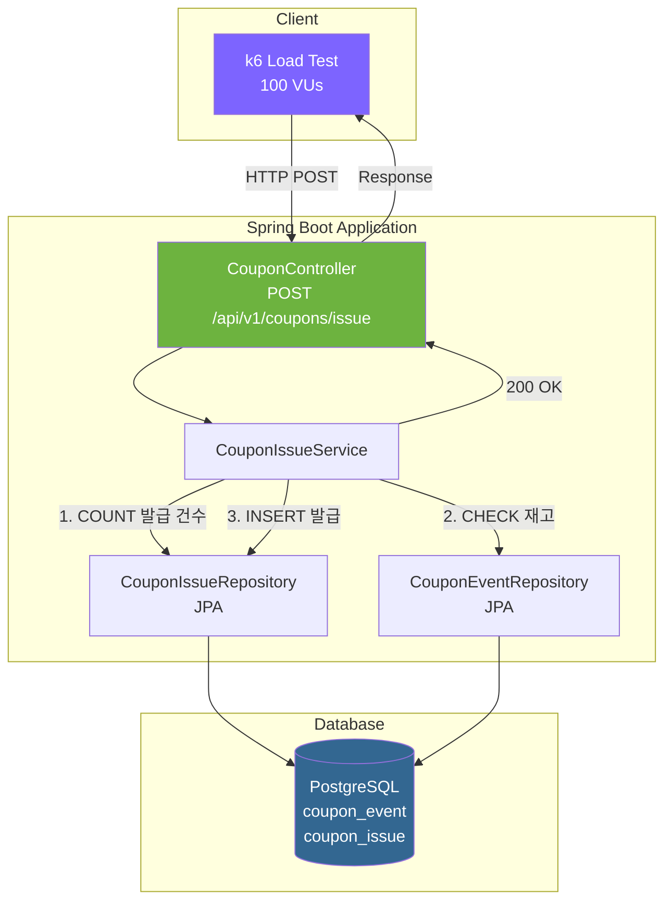
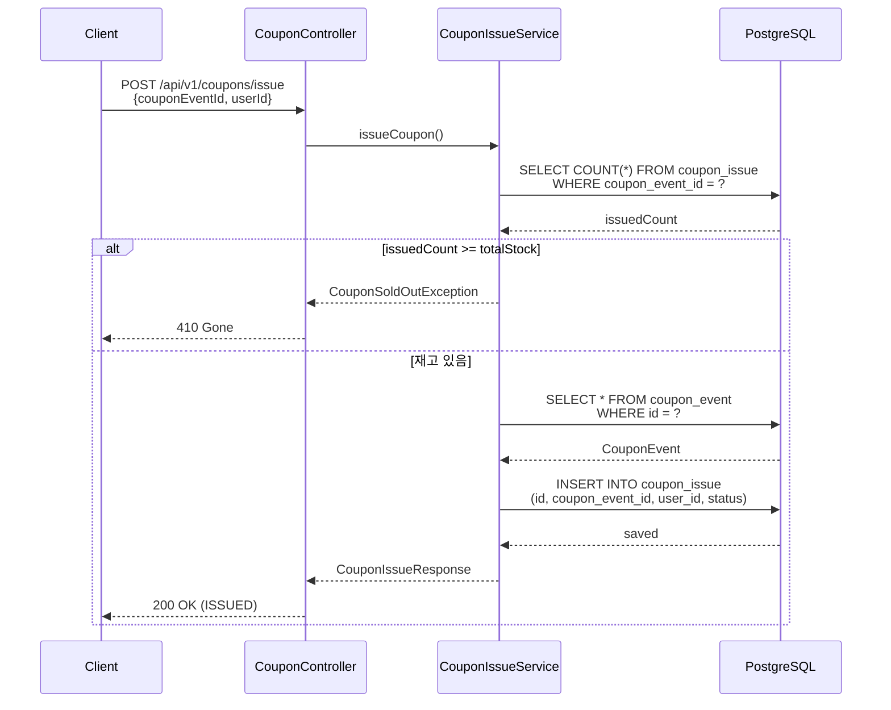
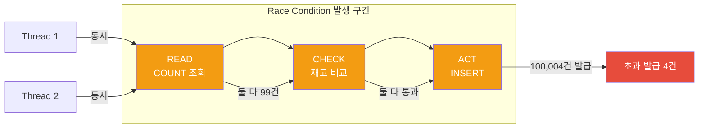

# Phase 1 아키텍처 — 동기 DB 직결 방식

## 시스템 아키텍처

## 요청 처리 흐름

## 문제점

## 성능 요약

| 지표 | 값 |
|------|-----|
| 평균 RPS | ~530 |
| 실제 발급 | 100,004건 |
| 초과 발급 | **4건 (Race Condition)** |
| 병목 지점 | DB check-then-act 비원자적 패턴 |
