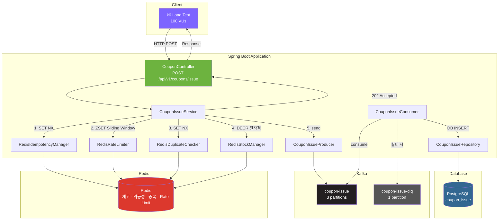
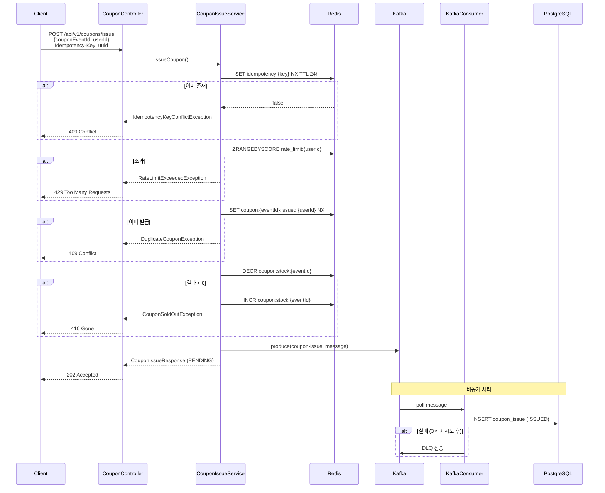
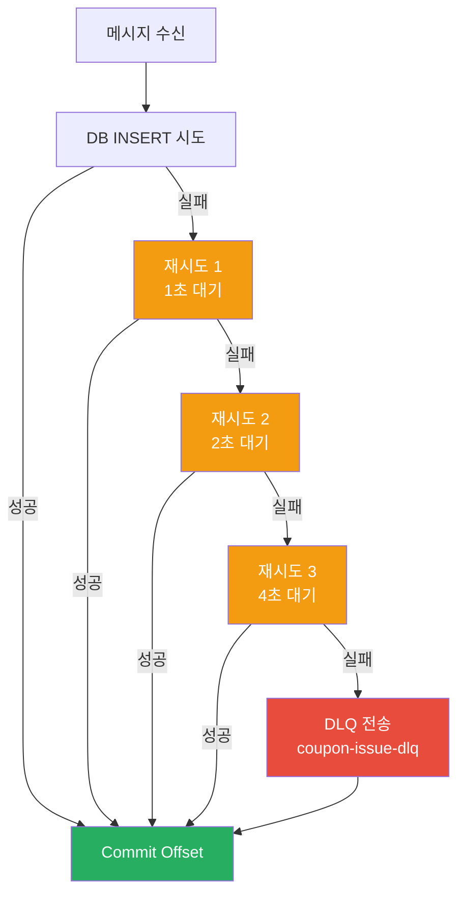
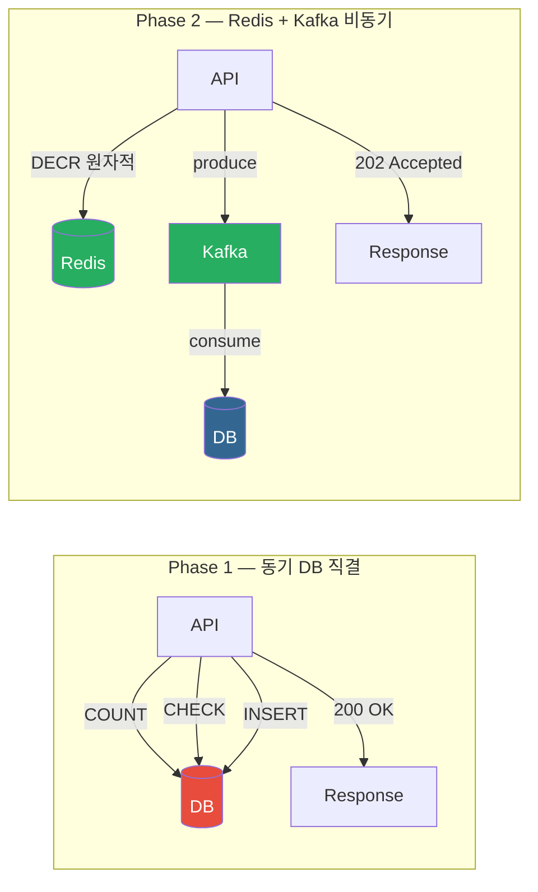

# Phase 2 아키텍처 — Redis + Kafka 비동기 파이프라인

## 시스템 아키텍처

## 요청 처리 흐름

## Kafka Consumer 에러 핸들링

## Phase 1 → Phase 2 비교

## 성능 요약

| 지표 | Phase 1 | Phase 2 | 변화 |
|------|---------|---------|------|
| 평균 RPS | ~530 | 543 | +2.5% |
| 실제 발급 | 100,004 | **100,000** | 정확 |
| 초과 발급 | **4건** | **0건** | 해결 |
| Latency avg | — | 5.44ms | — |
| Latency p95 | — | 12.04ms | — |
| Redis ↔ DB 정합성 | N/A | 100% | — |
| 에러 | 0 | 0 | — |
