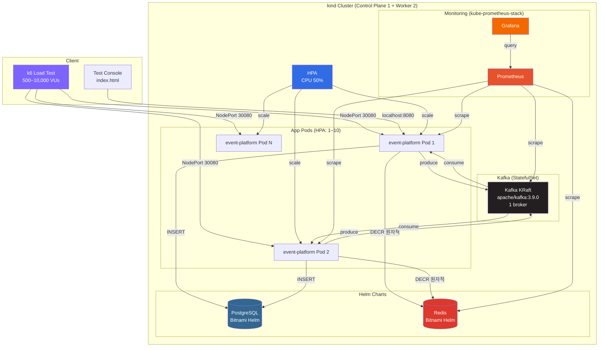
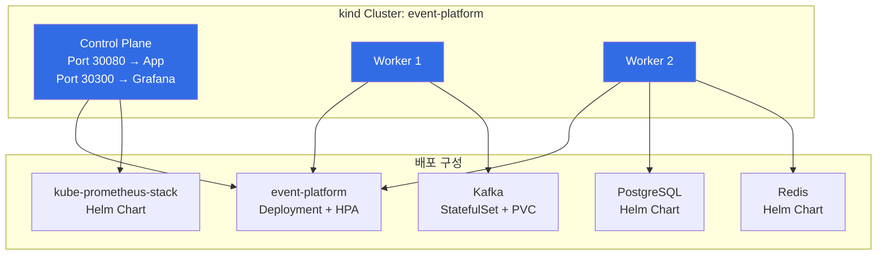
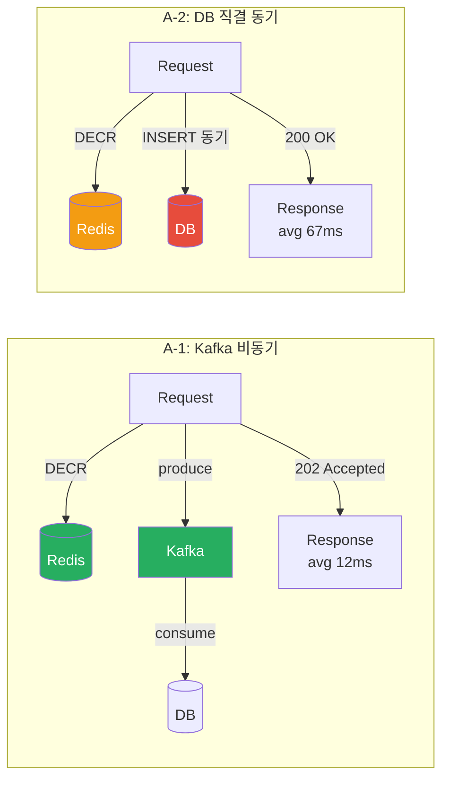
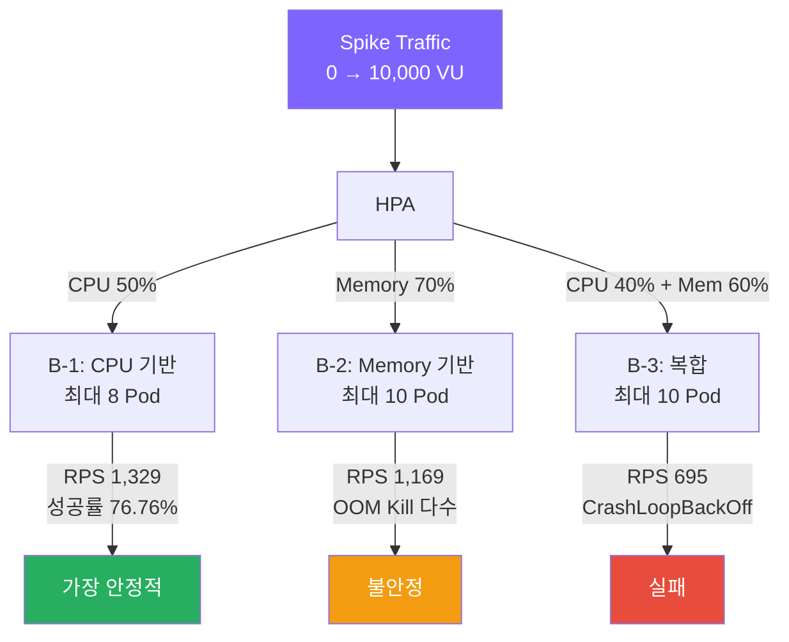
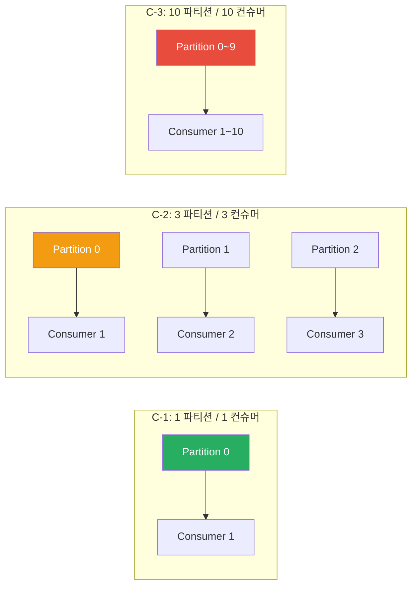
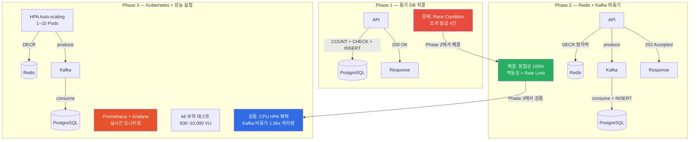
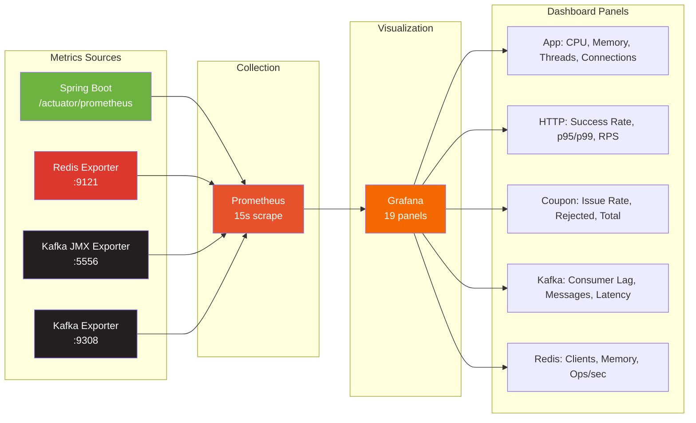
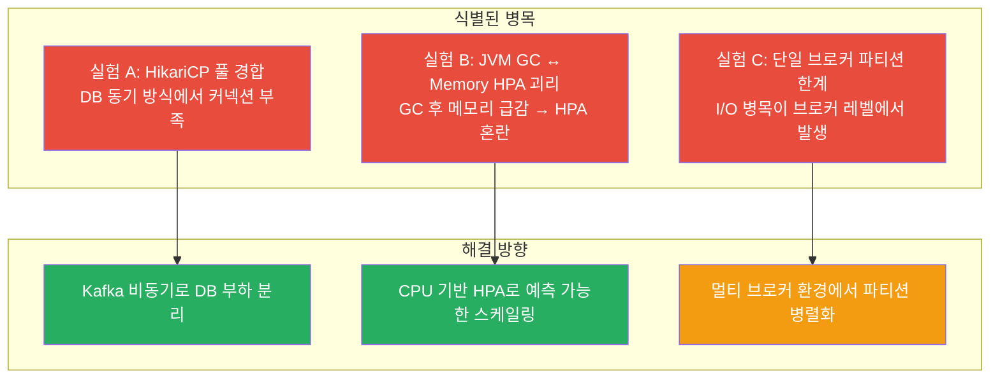

# Phase 3 아키텍처 — Kubernetes 배포 + 성능 실험

## 시스템 아키텍처



## kind 클러스터 구성



## Kubernetes 매니페스트 구조

```
k8s/
├── kind-config.yaml              # kind 클러스터 (CP 1 + Worker 2)
├── run-experiment-b.sh           # 실험 B 자동화 스크립트
├── app/
│   ├── deployment.yaml           # Deployment (replicas: 1, HPA 관리)
│   ├── service.yaml              # NodePort 30080
│   ├── configmap.yaml            # 환경변수 (DB/Redis/Kafka 연결)
│   ├── hpa-cpu.yaml              # CPU 50% 기반 HPA (채택)
│   ├── hpa-memory.yaml           # Memory 70% 기반 HPA (실험용)
│   └── hpa-custom.yaml           # Custom Metric HPA (실험용)
├── kafka/
│   └── kafka.yaml                # StatefulSet + Headless Service + PVC
├── values/
│   ├── postgresql-values.yaml    # Bitnami PostgreSQL Helm values
│   ├── redis-values.yaml         # Bitnami Redis Helm values
│   └── kafka-values.yaml         # Kafka Helm values
└── docs/
    └── access-urls.md            # 클러스터 접속 URL 정리
```

## 실험 A: DB 직결 vs Kafka 비동기



### 결과 (500 VU)

| 항목 | Async (Kafka) | Sync (DB) | 비율 |
|------|--------------|-----------|------|
| **RPS** | **4,711/s** | 3,019/s | **1.56x** |
| **p50 Latency** | **12.09ms** | 66.75ms | **5.5x 빠름** |
| **p95 Latency** | **46.98ms** | 96.19ms | **2.0x 빠름** |
| 정합성 | 100,000 | 100,000 | 동일 |

**결론**: Kafka 비동기 방식 채택 (ADR-007)

## 실험 B: HPA Auto-scaling 전략



### 결과

| 구성 | 최대 Pod | RPS | p95 Latency | 성공률 | 안정성 |
|------|---------|-----|-------------|--------|--------|
| **B-1 CPU 50%** | 8 | **1,329** | 24.42s | **76.76%** | 재시작 없음 |
| B-2 Memory 70% | 10 | 1,169 | 59.99s | 72.36% | OOM Kill |
| B-3 복합 | 10 | 695 | 54.47s | 25.99% | CrashLoop |

**결론**: CPU 기반 HPA 채택 (ADR-008)

## 실험 C: Kafka 파티션 튜닝



### 결과 (1,000 VU Spike)

| 지표 | C-1 (1/1) | C-2 (3/3) | C-3 (10/10) |
|------|-----------|-----------|-------------|
| **RPS** | **6,221** | 5,523 | 5,363 |
| p95 Latency | **118.46ms** | 168.88ms | 140.76ms |
| DB 발급 건수 | 100,000 | 100,000 | 100,000 |

**결론**: 단일 브로커 환경에서는 파티션 증가가 오히려 오버헤드. 멀티 브로커 환경에서 재검증 필요.

## Phase 1 → 2 → 3 아키텍처 진화



## 모니터링 스택



## App Deployment 상세

```yaml
# 리소스 제한
resources:
  requests: { cpu: 250m, memory: 512Mi }
  limits:   { cpu: 1000m, memory: 1Gi }

# Probes
readinessProbe: /actuator/health (30s 후, 10s 주기)
livenessProbe:  /actuator/health (60s 후, 15s 주기)

# HPA (채택: CPU 기반)
minReplicas: 1
maxReplicas: 10
targetCPUUtilization: 50%
```

## 병목 지점 분석



## 성능 요약 (Phase 1 → 2 → 3)

| 지표 | Phase 1 | Phase 2 | Phase 3 (Async) |
|------|---------|---------|-----------------|
| 평균 RPS | ~530 | 543 | **4,711** |
| p50 Latency | — | 5.44ms | **12.09ms** |
| p95 Latency | — | 12.04ms | **46.98ms** |
| 정합성 | 100,004 (초과 4건) | **100,000** | **100,000** |
| 스케일링 | 단일 프로세스 | 단일 프로세스 | **HPA 1~10 Pods** |
| 모니터링 | 없음 | Prometheus 기본 | **19 panel 대시보드** |
