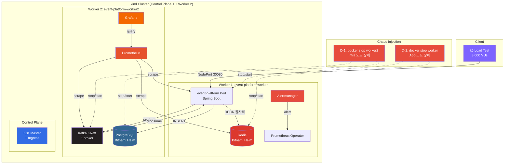
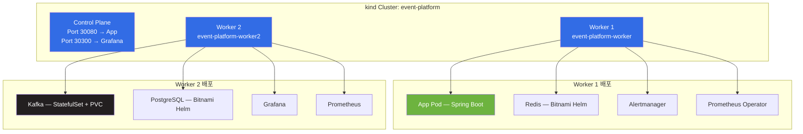
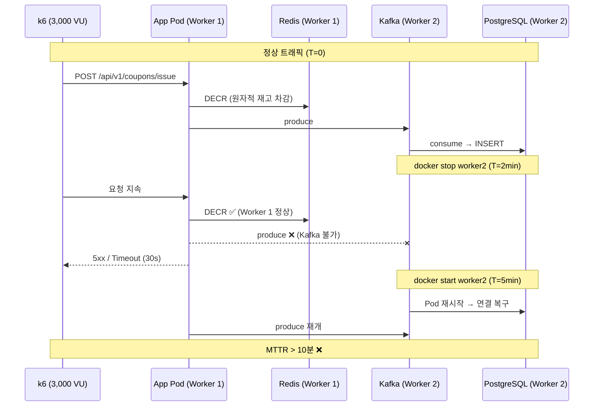
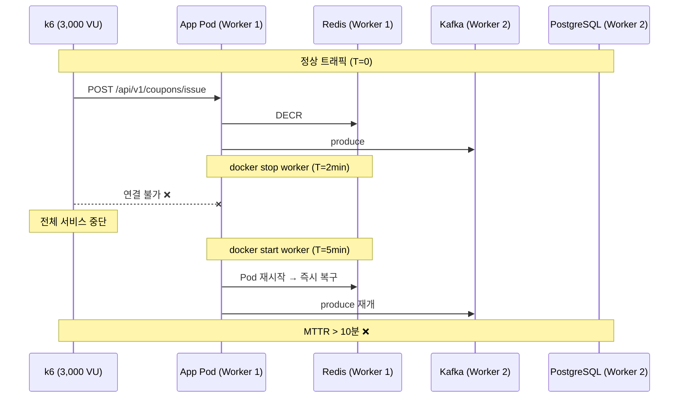
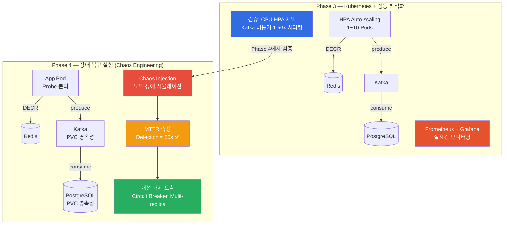
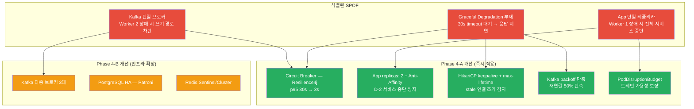

# Phase 4 아키텍처 — 장애 복구 실험 (Chaos Engineering)

## 시스템 아키텍처



## kind 클러스터 구성 (노드 역할 분리)



## 파일 구조

```
k8s/
├── kind-config.yaml              # kind 클러스터 (CP 1 + Worker 2)
├── run-experiment-d.sh           # 장애 복구 실험 자동화 스크립트
├── app/
│   ├── deployment.yaml           # Probe 분리 (liveness/readiness)
│   ├── service.yaml              # NodePort 30080
│   ├── configmap.yaml            # 환경변수 (DB/Redis/Kafka 연결)
│   └── hpa-cpu.yaml              # CPU 50% 기반 HPA
├── kafka/
│   └── kafka.yaml                # StatefulSet + PVC (데이터 영속성)
└── values/
    ├── postgresql-values.yaml    # PVC 영속성 설정
    └── redis-values.yaml         # Bitnami Redis Helm values

k6/
└── phase4-resilience.js          # 3,000 VU 장애 복구 부하 테스트

docs/adr/
└── 009-resilience-recovery-strategy.md  # Probe 분리 + 재연결 전략
```

## 실험 D-1: Infra 노드 장애 (Worker 2 — Kafka/PostgreSQL)



### 결과 (초기 → Probe 개선 후)

| 지표 | 초기 | Probe 개선 후 |
|------|------|-------------|
| 총 요청 수 | 134,261 | 122,272 |
| 평균 RPS | 209 req/s | — |
| 쿠폰 발급 성공 | 9,861건 | 7,592건 |
| 에러 (5xx/timeout) | 110,067건 | — |
| 성공률 | 18.02% | 6.21% |
| Detection Time | 52s ✅ | 56s ✅ |
| App Pod 재시작 | — | 7회 (변화 없음) |
| Total MTTR | > 10분 ❌ | > 10분 ❌ |

### MTTR 타임라인 (Probe 개선 후)

```
T_STOP      : 17:56:13  ── docker stop worker2
T_NOTREADY  : 17:57:09  ── +56s (노드 NotReady 감지)
T_RECOVER   : 18:00:09  ── docker start worker2
T_NODE_READY: 18:00:15  ── +6s (노드 Ready)
T_PODS_READY: 18:00:25  ── +10s (Pod Ready)
T_END       : 18:04:53  ── 테스트 종료 (완전 복구 미완)
```

**결론**: Kafka/PostgreSQL SPOF로 인해 MTTR > 10분. 단일 브로커 장애 시 전체 쓰기 경로 차단.

## 실험 D-2: App 노드 장애 (Worker 1 — App/Redis)



### 결과 (초기 → Probe 개선 후)

| 지표 | 초기 | Probe 개선 후 |
|------|------|-------------|
| 총 요청 수 | 146,841 | 129,884 |
| 평균 RPS | 229 req/s | — |
| 쿠폰 발급 성공 | 9,854건 | 15,298건 |
| 에러 (5xx/timeout) | 111,053건 | — |
| 성공률 | 24.37% | 11.78% |
| Detection Time | 46s ✅ | 47s ✅ |
| App Pod 재시작 | 5회 | 3회 (40% 감소 ✅) |
| Total MTTR | > 10분 ❌ | > 10분 ❌ |

### MTTR 타임라인 (Probe 개선 후)

```
T_STOP      : 18:10:47  ── docker stop worker
T_NOTREADY  : 18:11:34  ── +47s (노드 NotReady 감지)
T_RECOVER   : 18:14:34  ── docker start worker
T_NODE_READY: 18:14:39  ── +5s (노드 Ready)
T_PODS_READY: 18:14:39  ── 즉시 (0s, Pod 즉시 Ready)
T_END       : 18:19:18  ── 테스트 종료
```

**결론**: 단일 레플리카로 인해 전체 서비스 중단. Pod 재시작은 40% 감소했으나 MTTR 목표 미달.

## Phase 3 → 4 아키텍처 진화



## Probe 전략 (ADR-009 적용)

```yaml
# Phase 3: 단일 Probe
readinessProbe: /actuator/health (30s 후, 10s 주기)
livenessProbe:  /actuator/health (60s 후, 15s 주기)

# Phase 4: Probe 분리 (ADR-009)
readinessProbe:
  path: /actuator/health/readiness    # 트래픽 수신 가능 여부
  initialDelaySeconds: 30
  periodSeconds: 10
  failureThreshold: 6

livenessProbe:
  path: /actuator/health/liveness     # 프로세스 생존 여부
  initialDelaySeconds: 90             # 60s → 90s (기동 시간 확보)
  periodSeconds: 15
  failureThreshold: 6                 # 3 → 6 (불필요한 재시작 방지)
```

## 재연결 설정 (Spring Boot)

```yaml
# HikariCP (PostgreSQL)
spring.datasource.hikari:
  connection-test-query: SELECT 1
  validation-timeout: 3000
  connection-timeout: 5000

# Lettuce (Redis)
spring.data.redis.lettuce:
  shutdown-timeout: 200ms

# Kafka Consumer
spring.kafka.consumer.properties:
  reconnect.backoff.ms: 1000
  reconnect.backoff.max.ms: 10000
```

## 병목 지점 분석



## 예상 MTTR 개선

| 단계 | MTTR | 주요 변경 |
|------|------|----------|
| **현재 (Phase 4)** | > 10분 ❌ | 단일 레플리카, SPOF 다수 |
| **Phase 4-A 적용 후** | 3~5분 | Circuit Breaker, Multi-replica, PDB |
| **Phase 4-A + 4-B** | < 2분 ✅ | Kafka 3 broker, PostgreSQL HA, Redis HA |

## 성능 요약 (Phase 1 → 2 → 3 → 4)

| 지표 | Phase 1 | Phase 2 | Phase 3 | Phase 4 |
|------|---------|---------|---------|---------|
| 평균 RPS | ~530 | 543 | **4,711** | 209~229 (장애 중) |
| p95 Latency | — | 12.04ms | 46.98ms | 29.99s (장애 중) |
| 정합성 | 100,004 (초과 4건) | 100,000 | 100,000 | 100,000 |
| 스케일링 | 단일 프로세스 | 단일 프로세스 | HPA 1~10 Pods | HPA + Probe 분리 |
| 장애 감지 | 없음 | 없음 | 없음 | **≈ 50s (Detection)** |
| MTTR | 측정 없음 | 측정 없음 | 측정 없음 | **> 10분 (개선 필요)** |
| 모니터링 | 없음 | Prometheus 기본 | 19 panel 대시보드 | + Alertmanager |
